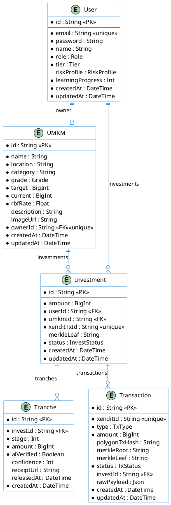
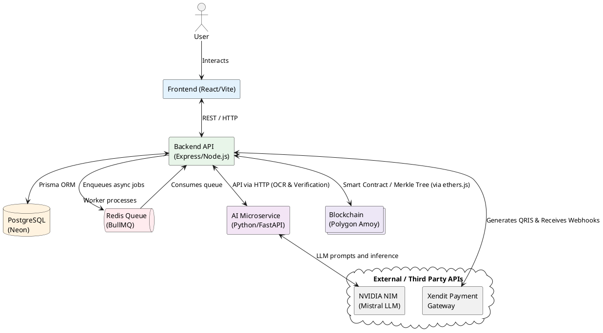
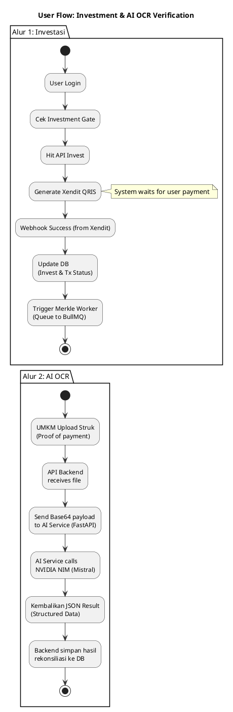

# NEMOS Architecture Audit Report

**Principal Software Architect & Systems Analyst Report**

This document contains a comprehensive architectural and component-level audit of the NEMOS ecosystem, utilizing PlantUML and DBML for structural mapping, system design overviews, and system interaction visualisations.

---

## 1. Entity Relationship Diagram (ERD)

The following schema maps the database models from `schema.prisma`. 



---

## 2. Database Visualizer (DBML)

A direct, standards-compliant translation of the Prisma Schema configured for dbdiagram.io integration.

```dbml
Project NEMOS {
  database_type: 'PostgreSQL'
  Note: 'NEMOS Database Schema'
}

Enum Role {
  INVESTOR
  UMKM_OWNER
}

Enum Tier {
  FREE
  PREMIUM
}

Enum RiskProfile {
  KONSERVATIF
  MODERAT
  AGRESIF
}

Enum Grade {
  A
  B
  C
}

Enum InvestStatus {
  PENDING
  ACTIVE
  COMPLETED
  DEFAULTED
}

Enum TxType {
  INVESTMENT
  REPAYMENT
}

Enum TxStatus {
  PENDING
  BATCHING
  CONFIRMED
  FAILED
}

Table User {
  id varchar [primary key, default: `cuid()`]
  email varchar [unique, not null]
  password varchar [not null]
  name varchar [not null]
  role Role [not null]
  tier Tier [not null, default: 'FREE']
  riskProfile RiskProfile
  learningProgress int [not null, default: 0]
  createdAt timestamp [not null, default: `now()`]
  updatedAt timestamp [not null]
}

Table UMKM {
  id varchar [primary key, default: `cuid()`]
  name varchar [not null]
  location varchar [not null]
  category varchar [not null]
  grade Grade [not null]
  target bigint [not null]
  current bigint [not null, default: 0]
  rbfRate float [not null]
  description varchar
  imageUrl varchar
  ownerId varchar [unique, not null]
  createdAt timestamp [not null, default: `now()`]
  updatedAt timestamp [not null]
}

Table Investment {
  id varchar [primary key, default: `cuid()`]
  amount bigint [not null]
  userId varchar [not null]
  umkmId varchar [not null]
  xenditTxId varchar [unique, not null]
  merkleLeaf varchar
  status InvestStatus [not null, default: 'PENDING']
  createdAt timestamp [not null, default: `now()`]
  updatedAt timestamp [not null]
}

Table Tranche {
  id varchar [primary key, default: `cuid()`]
  investId varchar [not null]
  stage int [not null]
  amount bigint [not null]
  aiVerified boolean [not null, default: false]
  confidence int
  receiptUrl varchar
  releasedAt timestamp
  createdAt timestamp [not null, default: `now()`]
}

Table Transaction {
  id varchar [primary key, default: `cuid()`]
  xenditId varchar [unique, not null]
  type TxType [not null]
  amount bigint [not null]
  polygonTxHash varchar
  merkleRoot varchar
  merkleLeaf varchar
  status TxStatus [not null, default: 'PENDING']
  investId varchar
  rawPayload json
  createdAt timestamp [not null, default: `now()`]
  updatedAt timestamp [not null]
}

Ref: UMKM.ownerId - User.id
Ref: Investment.userId > User.id
Ref: Investment.umkmId > UMKM.id
Ref: Tranche.investId > Investment.id
Ref: Transaction.investId > Investment.id
```

---

## 3. System Architecture / Component Diagram

An overview of high-level microservices and integrations across the NEMOS ecosystem.



---

## 4. User Flowcharts (Investasi & AI OCR)

Visual mapping of the critical core loops for Investment matching and AI-based receipt reconciliations.



This completes the audit of the architecture as it stands for presentation and documentation readiness.
